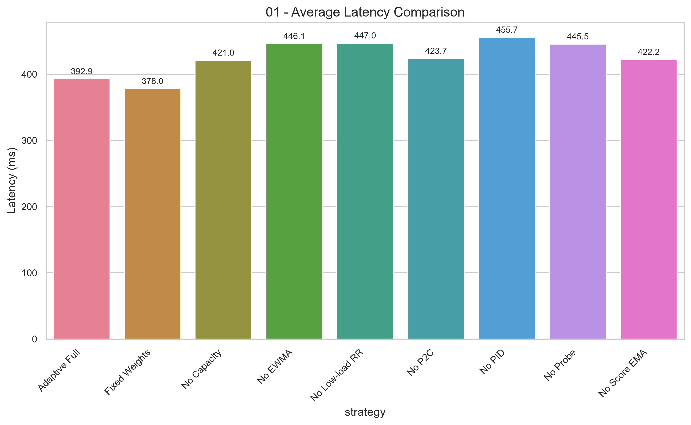
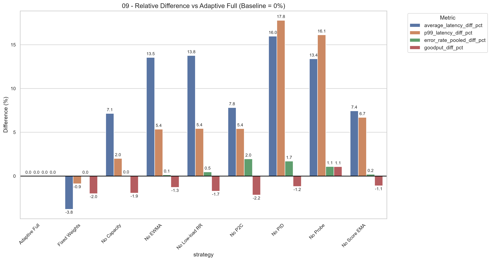
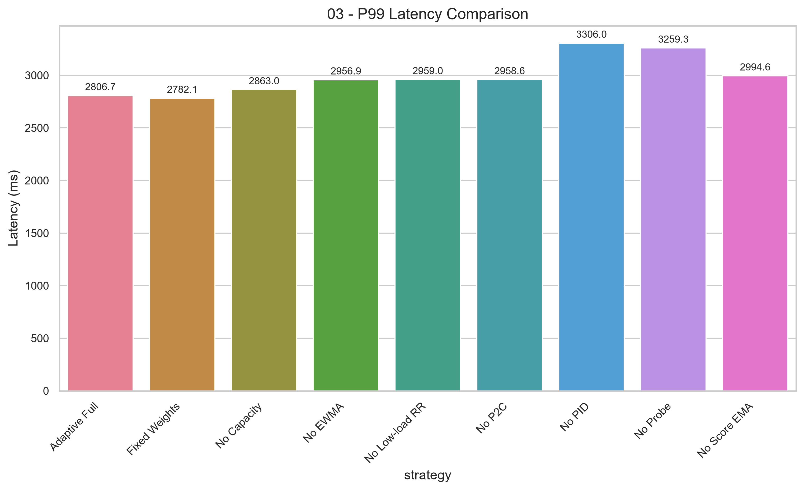
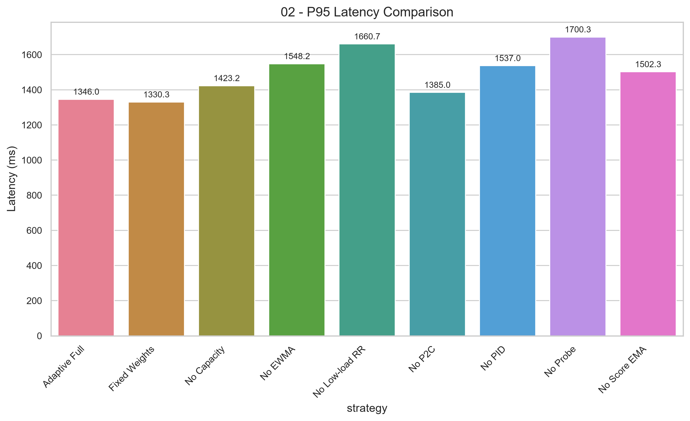
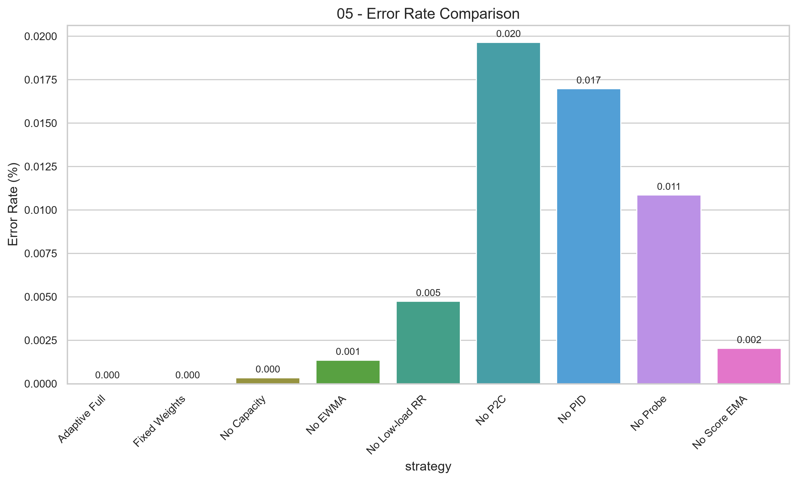
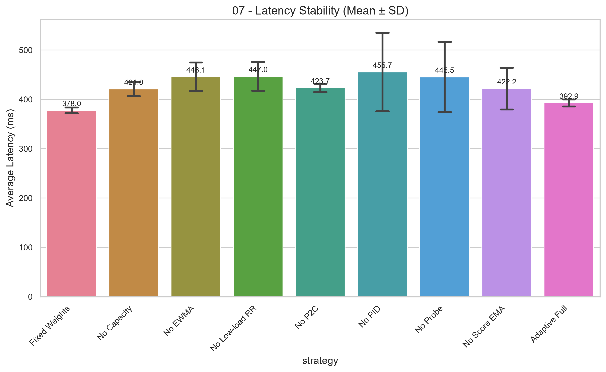

## 4.4 Phân tích chuyên sâu cơ chế thuật toán (Ablation Study)

### 4.4.1 Thiết kế thí nghiệm Ablation Study
Mục tiêu của nghiên cứu cắt bỏ (Ablation Study) là định lượng mức độ đóng góp của từng thành phần trong thuật toán Adaptive Load Balancer. Thực nghiệm sử dụng cấu hình Adaptive Full làm mốc tham chiếu (Baseline) và 8 cấu hình ablation tương ứng với việc vô hiệu hóa từng thành phần đơn lẻ. Mỗi cấu hình được chạy lặp lại 3 lần (tổng cộng 27 runs) dưới cùng điều kiện tải 600 RPS kết hợp lỗi "Dependency Slowdown" nhằm đảm bảo tính nhất quán trong so sánh.

### 4.4.2 Kết quả thực nghiệm Ablation Study
Bảng 4.10 trình bày kết quả thô được tổng hợp từ thực nghiệm. Các chỉ số là giá trị trung bình cộng của 3 lần lặp lại.

**Bảng 4.10: Kết quả trung bình 3 lần chạy của các cấu hình Ablation Study**
| Cấu hình | Avg Latency (ms) | Median (ms) | Mean P95 (ms) | Mean P99 (ms) | Error Rate (%) | Mean Throughput (RPS) | Estimated Goodput (RPS) |
|:---|---:|---:|---:|---:|---:|---:|---:|
| **Adaptive Full (Baseline)** | 392.92 | 156.67 | 1346.00 | 2806.67 | 0.000 | 555.77 | 555.77 |
| adaptive_fixed_weights | 378.03 | 131.00 | 1330.33 | 2782.10 | 0.000 | 544.64 | 544.64 |
| adaptive_no_capacity | 421.00 | 142.33 | 1423.22 | 2863.00 | 0.000 | 544.98 | 544.97 |
| adaptive_no_ewma_latency | 446.13 | 153.33 | 1548.25 | 2956.92 | 0.001 | 548.58 | 548.57 |
| adaptive_no_low_load_rr | 446.99 | 146.00 | 1660.67 | 2959.00 | 0.005 | 546.18 | 546.15 |
| adaptive_no_p2c | 423.65 | 136.33 | 1385.00 | 2958.57 | 0.020 | 543.85 | 543.74 |
| adaptive_no_pid | 455.68 | 162.00 | 1537.00 | 3306.00 | 0.017 | 549.24 | 549.15 |
| adaptive_no_probe | 445.52 | 139.67 | 1700.33 | 3259.31 | 0.011 | 561.79 | 561.73 |
| adaptive_no_score_ema | 422.16 | 136.33 | 1502.33 | 2994.65 | 0.002 | 549.62 | 549.61 |

Dữ liệu cho thấy cấu hình Adaptive Full đạt được sự cân bằng tốt nhất về hiệu năng tổng thể và không ghi nhận lỗi. Phần lớn các thành phần khi bị loại bỏ đều làm gia tăng độ trễ đuôi (P95/P99) và xuất hiện tỷ lệ lỗi nhỏ. Đáng chú ý, cấu hình `fixed_weights` ghi nhận độ trễ trung bình thấp hơn Baseline nhưng lại suy giảm về thông lượng hữu ích (Goodput), cho thấy có sự đánh đổi giữa các yếu tố hiệu năng.

### 4.4.3 Đánh giá tác động của việc cắt bỏ thành phần thuật toán
Để đánh giá trực quan hơn, Bảng 4.11 trình bày sự chênh lệch tương đối giữa các biến thể và cấu hình Baseline.

**Bảng 4.11: Đánh giá tác động cắt bỏ thành phần thuật toán (So với Baseline)**
| Cấu hình Ablation | Thành phần bị loại bỏ | Avg Latency | P95 | P99 | Error Rate | Estimated Goodput |
|:---|:---|---:|---:|---:|---:|---:|
| `adaptive_fixed_weights` | Trọng số Entropy động | -3.79% | -1.16% | -0.87% | +0.000% | -2.00% |
| `adaptive_no_capacity` | Trọng số tài nguyên tĩnh | +7.15% | +5.74% | +2.01% | +0.000% | -1.94% |
| `adaptive_no_ewma_latency` | Bộ lọc độ trễ trượt mũ | +13.54% | +15.02% | +5.35% | +0.001% | -1.29% |
| `adaptive_no_low_load_rr`| Round Robin khi tải thấp| +13.76% | +23.38% | +5.43% | +0.005% | -1.73% |
| `adaptive_no_p2c` | Nguyên lý chọn 2 ngẫu nhiên| +7.82% | +2.89% | +5.41% | +0.020% | -2.16% |
| `adaptive_no_pid` | Bộ phạt vi tích phân PID | +15.97% | +14.19% | +17.79% | +0.017% | -1.19% |
| `adaptive_no_probe` | Cơ chế thăm dò phục hồi | +13.39% | +26.32% | +16.13% | +0.011% | +1.07% |
| `adaptive_no_score_ema` | Bộ lọc điểm số tổng hợp | +7.44% | +11.61% | +6.70% | +0.002% | -1.11% |

Trong bảng trên, giá trị dương (+) ở các cột độ trễ và tỷ lệ lỗi thể hiện sự suy giảm hiệu năng so với Adaptive Full (mức 0%). Ngược lại, giá trị âm (-) ở cột Goodput cho thấy sự sụt giảm về thông lượng khả dụng.

### 4.4.4 Phân tích ảnh hưởng của từng thành phần
Dựa trên kết quả thực nghiệm, mức độ ảnh hưởng của các thành phần có thể được tổng hợp thành 5 nhóm phát hiện chính:

**1. PID Controller**
Khi loại bỏ hàm phạt PID, độ trễ P99 tăng 17.79% (lên 3306.00 ms) và độ trễ trung bình tăng 15.97%. Kết quả này cho thấy PID có vai trò quan trọng trong việc phản ứng kịp thời trước các điểm nghẽn, hỗ trợ kiểm soát Tail Latency trong điều kiện thử nghiệm.

**2. Probe**
Việc thiếu cơ chế thăm dò phục hồi khiến P95 tăng 26.32% và P99 tăng 16.13%. Số liệu này phản ánh việc Probe đóng vai trò cần thiết trong việc phát hiện và đưa các node bị suy giảm tái hòa nhập mượt mà vào hệ thống, tránh việc dồn tải cục bộ vào các node còn lại.

**3. P2C (Power of Two Choices)**
Cấu hình không sử dụng P2C ghi nhận tỷ lệ lỗi tăng lên mức 0.020%, cao nhất trong tất cả các biến thể. Phát hiện này hỗ trợ nguyên lý của P2C trong việc hạn chế sự tập trung tải quá mức (load concentration) vào một máy chủ duy nhất tại một thời điểm.

**4. EWMA Latency và Score EMA**
Cắt bỏ bộ lọc EWMA khiến độ trễ trung bình tăng 13.54%, trong khi cắt bỏ Score EMA làm P95 tăng 11.61%. Các bộ lọc này góp phần giảm thiểu dao động của tín hiệu môi trường, từ đó cải thiện tính ổn định của các quyết định định tuyến.

**5. Fixed Weights và Capacity Weights**
Sự kết hợp giữa Fixed Weights và Capacity Weights phản ánh một sự đánh đổi (trade-off). Fixed Weights làm giảm độ trễ trung bình 3.79% nhưng cũng làm suy giảm Goodput 2.00%. Trong khi đó, việc loại bỏ Capacity Weights chỉ làm tăng P95 thêm 5.74%. Hai thành phần này có mức độ ảnh hưởng tương đối thấp ở điều kiện tải 600 RPS, nhưng vẫn đóng vai trò trong việc cân bằng hiệu năng tổng thể.

### 4.4.5 Tổng hợp mức độ đóng góp của các thành phần
Từ các phân tích trên, các thành phần được phân loại theo mức độ ảnh hưởng thực nghiệm đối với hiệu năng định tuyến.

**Bảng 4.12: Xếp hạng mức độ ảnh hưởng thực nghiệm trong điều kiện thử nghiệm**
| Nhóm ảnh hưởng | Các thành phần | Metric chịu ảnh hưởng chính |
|:---|:---|:---|
| **Ảnh hưởng lớn** | PID, Probe, P2C | P95, P99, Error Rate |
| **Ảnh hưởng trung bình** | EWMA Latency, Score EMA, Low-load RR | Avg Latency, Độ ổn định |
| **Ảnh hưởng thấp** | Capacity Weights | P95 |
| **Đánh đổi (Trade-off)** | Trọng số động Entropy (so với Fixed Weights) | Avg Latency vs Goodput |

Việc phân nhóm này chỉ phản ánh mức độ ảnh hưởng thực nghiệm trong điều kiện thử nghiệm (workload 600 RPS kết hợp sự cố suy thoái một node). Thứ tự này không mang tính khẳng định tuyệt đối cho mọi điều kiện vận hành.

### 4.4.6 Thảo luận và Các rủi ro ảnh hưởng đến độ tin cậy (Threats to Validity)
Kết quả của nghiên cứu cắt bỏ cung cấp các quan sát định lượng, tuy nhiên cần lưu ý một số yếu tố rủi ro:
1. Thực nghiệm chỉ thực hiện 3 lần chạy (n=3) cho mỗi cấu hình, do đó chưa đủ kích thước mẫu để thực hiện các kiểm định ý nghĩa thống kê (statistical significance) chặt chẽ.
2. Mức giảm độ trễ của cấu hình Fixed Weights có thể liên quan đến overhead tính toán CPU của thuật toán Entropy, tuy nhiên kết luận này chưa thể xác nhận do thiếu dữ liệu CPU Profiling trực tiếp từ Gateway.
3. Ảnh hưởng của Capacity Weights được đánh giá ở mức tải 600 RPS, vai trò của nó có thể thay đổi rõ rệt khi hệ thống chạm ngưỡng bão hòa phần cứng ở các mức tải cao hơn.

### 4.4.7 Kết luận Ablation Study
Kết quả phân tích Ablation Study cho thấy cấu hình Adaptive Full cung cấp sự cân bằng hiệu năng tốt nhất trong điều kiện thử nghiệm hiện tại. Dữ liệu thực nghiệm xác nhận PID ảnh hưởng rõ rệt đến việc kiểm soát Tail Latency, trong khi cơ chế Probe giúp hạn chế sự phình to của phân vị P95 và P99. Bên cạnh đó, thuật toán P2C thể hiện sự liên quan trực tiếp đến khả năng giảm thiểu Error Rate bằng cách phân tán luồng tải. Các bộ lọc làm mượt như EWMA và Score EMA đóng góp vào tính ổn định của quyết định định tuyến, còn Capacity Weights có tác động hạn chế ở mức tải trung bình. Nhìn chung, kết quả định lượng đã hỗ trợ tính hợp lý của kiến trúc định tuyến đa thành phần được thiết kế trong Adaptive Load Balancer.
